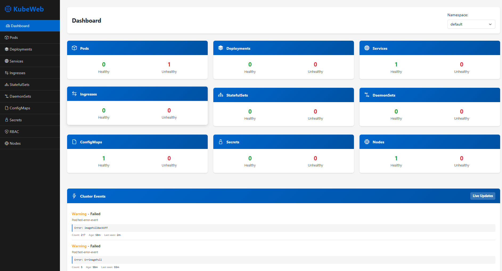

# KubeWeb - Kubernetes Management UI

A lightweight, local web-based Kubernetes management interface built with vanilla JavaScript and Bootstrap 5. No complex web server setup required—just run and manage your EKS cluster from your browser.

## Dashboard



## Features

- ✨ **Clean Web UI** - Modern Bootstrap 5 interface with dark sidebar
- 🔐 **KUBECONFIG Integration** - Automatically uses your default kubectl configuration
- 📊 **Dashboard** - Quick overview of resource counts
- 🐳 **Pod Management** - View logs, describe pods, and delete resources
- 🚀 **Deployments** - Monitor and manage deployments
- 🌍 **Services & Ingresses** - Manage networking resources
- 📦 **StatefulSets & DaemonSets** - Full lifecycle management
- 🛡️ **RBAC** - View ClusterRoles and Roles
- 🔧 **ConfigMaps & Secrets** - Manage configuration resources
- 📝 **Resource Details** - View full YAML descriptions
- 🔍 **Namespace Switching** - Easy namespace selection
- ⚡ **Real-time Updates** - Click-to-refresh resource views

## Prerequisites

- **Node.js** (v14 or higher)
- **kubectl** installed and configured
- **KUBECONFIG** environment variable set (or default ~/.kube/config)
- **Active EKS cluster** (or any Kubernetes cluster)

## Installation

1. Navigate to the project directory:
```bash
cd kubeweb
```

2. Install dependencies:
```bash
npm install
```

## Usage

### Start the application:
```bash
npm start
```

The server will start on `http://localhost:3000` by default.

### Custom port:
```bash
PORT=3001 npm start
```

### Open in your browser:
```
http://localhost:3000
```

## Architecture

### Backend (Node.js + Express)
- Runs kubectl commands with your KUBECONFIG
- Provides REST API endpoints for all Kubernetes resources
- Handles authentication and cluster communication
- No persistent storage or database required

### Frontend (Vanilla JavaScript + Bootstrap 5)
- Static HTML/JS that communicates with local API
- Responsive design works on desktop and tablets
- Real-time resource updates
- Zero external dependencies (uses CDN for Bootstrap and icons)

## API Endpoints

### Available endpoints (all return JSON):

#### Cluster Info
- `GET /api/namespaces` - List all namespaces
- `GET /api/describe/:resource/:namespace/:name` - Describe any resource

#### Pods
- `GET /api/pods?namespace=default` - List pods
- `GET /api/pods/:namespace/:name` - Get pod details
- `GET /api/pods/:namespace/:name/logs` - Get pod logs
- `DELETE /api/pod/:namespace/:name` - Delete a pod

#### Deployments
- `GET /api/deployments?namespace=default` - List deployments
- `DELETE /api/deployment/:namespace/:name` - Delete a deployment

#### Services
- `GET /api/services?namespace=default` - List services
- `DELETE /api/service/:namespace/:name` - Delete a service

#### Ingresses
- `GET /api/ingresses?namespace=default` - List ingresses
- `DELETE /api/ingress/:namespace/:name` - Delete an ingress

#### StatefulSets
- `GET /api/statefulsets?namespace=default` - List StatefulSets
- `DELETE /api/statefulset/:namespace/:name` - Delete a StatefulSet

#### DaemonSets
- `GET /api/daemonsets?namespace=default` - List DaemonSets
- `DELETE /api/daemonset/:namespace/:name` - Delete a DaemonSet

#### ConfigMaps
- `GET /api/configmaps?namespace=default` - List ConfigMaps
- `DELETE /api/configmap/:namespace/:name` - Delete a ConfigMap

#### Secrets
- `GET /api/secrets?namespace=default` - List Secrets
- `DELETE /api/secret/:namespace/:name` - Delete a Secret

#### RBAC
- `GET /api/clusterroles` - List ClusterRoles
- `GET /api/roles?namespace=default` - List Roles
- `DELETE /api/role/:namespace/:name` - Delete a Role

## How It Works

1. **Local Server** - Node.js Express server runs on localhost
2. **kubectl Proxy** - Backend shells out to kubectl commands using your KUBECONFIG
3. **REST API** - All kubectl data is converted to JSON and served via REST endpoints
4. **Static Frontend** - HTML/JS UI communicates with the local API
5. **No External Calls** - Everything stays local to your machine

## Project Structure

```
kubeweb/
├── server.js           # Express backend - kubectl command processor
├── package.json        # Node.js dependencies
├── public/
│   ├── index.html      # Main UI (Bootstrap 5)
│   └── app.js          # Frontend logic (vanilla JavaScript)
└── README.md           # This file
```

## Development

### Install dev dependencies:
```bash
npm install --save-dev nodemon
```

### Run with auto-reload:
```bash
npx nodemon server.js
```

## Troubleshooting

### Connection failed
- Ensure kubectl is installed: `kubectl version`
- Check KUBECONFIG: `echo $KUBECONFIG` or `~/.kube/config`
- Test kubectl: `kubectl get nodes`

### Pods not loading
- Verify namespace exists: `kubectl get namespace`
- Check permissions: `kubectl auth can-i get pods --as=$(kubectl config current-context)`

### API errors
- Check the terminal where server is running for error messages
- Ensure port 3000 is not in use

## Performance Notes

- Large clusters (1000+ pods) may take a few seconds to load
- Data is fetched on-demand (not cached)
- Consider using namespace selector to limit results

## Security Notes

- This tool runs **locally only** - no data sent to external servers
- Uses your existing KUBECONFIG authentication
- Keep kubectl credentials secure
- Don't expose this port to the network

## Future Enhancements

- Edit YAML resources directly
- Apply new resources from UI
- Persistent auto-refresh
- Resource usage graphs
- Event streaming
- Multi-cluster support
- Dark/Light theme toggle

## License

MIT

## Support

For issues or feature requests, ensure you have:
- Latest Node.js version
- Updated kubectl
- Valid KUBECONFIG

---

**Built with ❤️ to make Kubernetes management easier**
